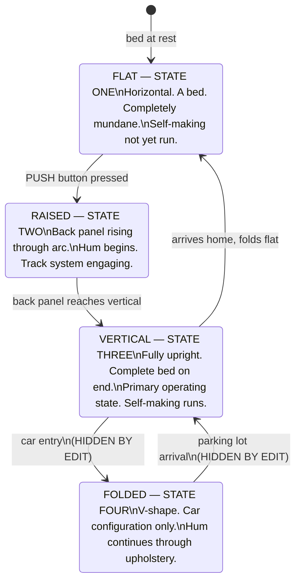
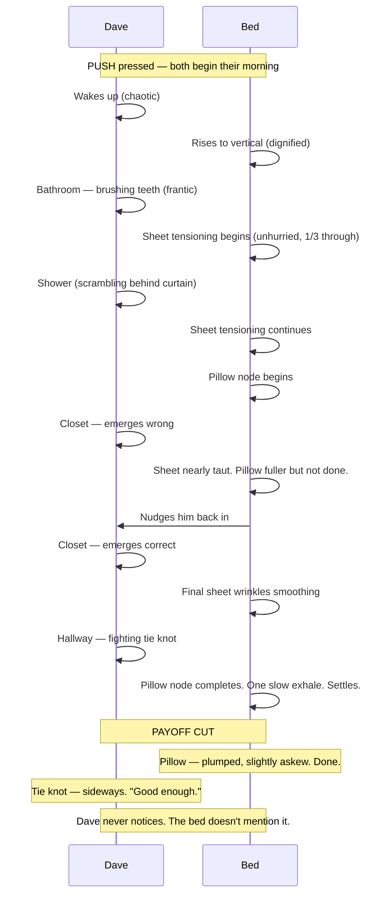

# PUSH — Design Memorandum

## The Bed as Cinematic Character: Environmental Integration & Physical Design

**Project:** PUSH  
**Author:** Aaron Davis  
**Date:** April 27, 2026  
**Version:** 1.0  
**Status:** Working Document

**Companion documents:** Prop Bible v3.1 · Bed Proportions Guide v4.4 · Visual Reference Guide v4.1 · AI Shot List v4.5

---

## 1. Origin of the Problem

This memorandum documents a design conversation initiated by research into Netflix's animated series _Trash Truck_ (2020, creator Max Keane). The central question: how does a full-size garbage truck function as a child's best friend — appearing in bedrooms, movie theaters, dental offices — without ever breaking the spatial logic of the scene?

The answer to that question became the design foundation for _PUSH_.

The specific concern: there is no published craft documentation on _Trash Truck_'s production design decisions at the level of detail that would be useful — no Cartoon Brew deep dive, no AWN pipeline breakdown. The show is under-covered in the animation trade press. What exists are creator interviews that touch on tone and influence, not on the mechanics of making an impossible object feel inevitable. The production design team's work is felt rather than explained.

This memorandum attempts to reconstruct those principles from observation and apply them to a new problem.

---

## 2. The Trash Truck Principle

_Trash Truck_ solved its impossible geometry through a specific philosophy:

> **The environment bends to accommodate the relationship, not the other way around.**

The truck is never shown entering through a door. It is simply present — the way a dog is present when you wake up. The trick happens in the cut.

Three mechanisms make this work:

**Scale Ambiguity.** No scene establishes a ground-truth scale relationship between the truck and the room. The camera never pulls wide enough for the audience to do the math. You feel the size difference emotionally without the physics ever being checked.

**The Edit as Sleight of Hand.** Every impossible transition — truck entering a house, truck fitting in a bedroom — happens off-screen. The cut does the work the geometry cannot. This is how stage magic works: the audience's imagination fills in what the camera withholds.

**Ambient Lighting Integration.** The truck is lit by the same sources as every environment it occupies. It picks up warm bedroom light, movie theater glow, dental office fluorescence. It never looks like it was shot on a different set. This is the single most powerful tool for making an impossible object feel inevitable — and the most commonly failed one in visual effects work.

The production design team pre-solved every environment for the truck before placing anything else. Wider doorframes, taller ceilings, slightly larger-scale furniture — invisible accommodation, executed with confidence.

**The core insight: audiences don't measure. They feel.** If the bed feels right in the space, the audience accepts it. The moment you signal that the bed is weird or shouldn't fit, they start noticing that it doesn't.

---

## 3. Applying the Principle: The Six Golden Rules

These rules govern every shot involving the PUSH in _PUSH_.

**Rule 1: Edit Around Impossibility.**
Never show the bed passing through an opening that wouldn't work in reality. Cut before it enters. Cut after it has arrived. The audience fills in the gap.
_Applied to:_ the front door, the elevator interior, the car entry.

**Rule 2: Frame Wide or Frame Close. Never Medium.**
Medium shots invite spatial analysis — the audience can see Dave, the bed, and the surrounding walls simultaneously and start measuring. Wide shots read as illustration. Close shots have shallow backgrounds. Both prevent the audience from doing the math.

**Rule 3: Light the Bed Like the Room.**
The bed must catch the same light sources as everything else in the frame. Bedroom: warm window light. Office: flat fluorescent. Kitchen: golden morning. If the bed looks composited, the illusion collapses immediately.

**Rule 4: Dave Never Looks at the Space Like It's Wrong.**
Dave treats the bed as a normal thing that fits through normal spaces because it's his bed and it's doing what beds do. His complete acceptance is the audience's permission to accept. If he glances at a doorframe with doubt, the audience adopts that confusion.

**Rule 5: The Bed Has Weight.**
A bed that floats through environments looks like a prop. A bed that has inertia — that takes a moment to stop, that causes Dave to stumble slightly when nudged — feels real. Weight grants spatial reality. If the bed behaves like a heavy object, the audience grants it the physical reality of a heavy object, including the space it takes up.

**Rule 6: Design Environments First.**
Before generating any shot with the bed in motion, design the environment with the bed's proportions in mind. Widen doorframes slightly. Raise ceilings a foot. Push furniture back. Do this invisibly — the space reads as normal — but build the bed's path first, then put everything else around it.

**Rule 7 (implicit, not previously codified):**
Dave's eyeline is always the bed or forward. Never the doorframe, never the ceiling. The camera follows his gaze. If his eyes never check whether the bed fits, neither do ours.

---

## 4. The Cinematographic Problem: Body Language Across Angles

The _Trash Truck_ comparison reveals a secondary problem that the original prop spec did not address.

The truck works not just because of _how_ it enters spaces — but because the camera can explore it the way it explores any character's body. A shot catches the truck's bumper. A wide shows its full silhouette. A low angle reveals the undercarriage rolling past. A close-up lands on a headlight like an eye. A shot from behind shows the cab's profile against the road.

The truck has **topography**: bumpers that jut, wheel wells that recess, a cab that rises, an exhaust stack that punctuates. Every crop gives a different readable shape. Every angle has a distinct emotional register.

The bed, as originally conceived, is a rectangle. Front, back, side — every angle reads the same flat surface. This is the problem the following design decisions address.

The goal is five distinct angle types that can be cut together the way _Trash Truck_ cuts between the truck's face, back, undercarriage, and shoulder:

| Angle         | Crop Area                   | Emotional Read       |
| ------------- | --------------------------- | -------------------- |
| Face          | Pillow stack + top frame    | Watching / character |
| Back          | Rear panel + motor housings | Mechanical / vehicle |
| Undercarriage | Track system + base         | Weight / locomotion  |
| Flank         | Side rail + struts          | Posture / scale      |
| Texture       | Soft goods close-up         | Domestic / intimate  |

No single angle tells the whole story. Together they establish a character with a body.

---

## 5. Physical Design Evolution

### 5.1 Track System (Replacing Casters)

The original prop spec used low-profile casters. These are replaced by a **continuous track system** — functionally analogous to a tank tread.

**Rationale — engineering:** Tracks navigate carpet, hardwood, tile, and concrete reliably. A caster system that catches on a rug edge or tile grout is a prop problem. A track system that rides over surface transitions is a vehicle.

**Rationale — cinematics:** A low shot of the tread rolling across different floor surfaces gives texture, sound design opportunity, and a completely distinct silhouette. Tracks have rhythm — individual links passing, drive sprockets engaging — that implies _locomotion_ rather than just _movement_. Casters suggest furniture being pushed. Tracks suggest a vehicle with a destination.

**Key components visible at various angles:**

- Drive sprockets at rear corners where track teeth engage the links
- Return rollers along the upper track run
- Front idler wheels
- Track links with visible articulation
- Ground contact surface — texture changes visibly on hardwood vs. carpet vs. concrete

The track system also generates distinct sound design at each floor type — a detail that reinforces presence without requiring visual confirmation.

### 5.2 Rear Engine Panel

The back of the bed was previously a blank panel — cinematically inert from behind. It becomes the bed's engine room: the angle that reveals what the bed actually is underneath its domestic surface.

| Component                | Function                                          | Cinematic Value                              |
| ------------------------ | ------------------------------------------------- | -------------------------------------------- |
| Dual drive motors        | One per track; differential speed enables turning | Housings give rear a distinct silhouette     |
| Battery pack             | Low-mounted for center of gravity                 | Panel with charge indicator light            |
| Cable routing            | Connects motor, pneumatics, charge system         | Wire looms that imply inhabited engineering  |
| Charge port              | Lower right corner                                | Small readable detail in tight rear crop     |
| Structural frame members | Load-bearing in vertical state                    | Grid of negative space; geometry at distance |

The rear panel should feel the way the back of a vintage Land Rover feels: you understand roughly how it works, you know it has a face you haven't seen yet, and you know it's a vehicle.

From behind, slightly below, tracks rolling — that shot should convey the same thing as a rear shot of a purposeful machine. Not complex. Specific.

### 5.3 The Bed as Dressed Character

The critical reframe: **stop thinking about the bed as a prop. Think about it as a dressed character.**

A real well-made bed has distinct stacked layers, each with different material behavior — the way it drapes, catches light, holds a wrinkle. In STATE THREE (vertical), all of that becomes a **costume** with texture and depth at every angle.

**The layer stack:**

```
Fitted sheet        →  tight to mattress, defines the body
Flat sheet          →  first draping layer, different behavior at corners
Blanket or quilt    →  mid-weight, visible fold at top
Duvet               →  outer layer, volume and shadow
Duvet cover         →  character color and pattern
Euro shams          →  structural backing to pillow stack
Sleeping pillows    →  primary, contains pneumatic node
Decorative pillows  →  personality layer (character-specific)
Throw (optional)    →  foot of bed, adds color break
```

Each layer is a different close-up opportunity. A shot of the mattress corner shows three or four distinct material edges. A shot along the top of the vertical bed shows the pillow stack as a crown. The duvet falling away from the foot of the vertical bed is fabric in motion — entirely different texture from the mechanical surfaces below.

**Multiple pillows change the silhouette of the head entirely.** One pillow is a flat top. Three pillows is a crown. A Euro sham behind a sleeping pillow is a layered collar. The bed's "face" gains structure that can be read from across the room.

---

## 6. The Bed Universe: Costume Design Framework

Every bed in the film has a costume dossier — the equivalent of a costume designer's character bible. Same product, different human.

### 6.1 Dave's PUSH (Base) — Dark Charcoal / Navy

The bachelor bed. Functional, not quite put-together. A person who means to do better.

| Element | Spec | Character Read |
| --- | --- | --- |
| Frame | Dark charcoal, cool blue undertone | Corporate-adjacent, slightly ominous |
| Badge | `RISE / The PUSH / Smart Adjustable Base` | Base model |
| Fitted sheet | Navy, slightly faded | Has been washed many times |
| Flat sheet | White, often untucked or balled at foot | Good intentions, imperfect execution |
| Duvet | None | He never bought one |
| PUSH pillow | One (hardware, pneumatic node, white pillowcase) | The product |
| Personal pillow | One — flat, generic white, from college | The second pillow tells you everything |
| Throw | None | |
| Self-making | Tensioning bar (fitted sheet only) + one node (PUSH pillow only) | His flat sheet stays balled. His college pillow sits undisturbed. |

The bed is dressed the way Dave is dressed: functional, not quite assembled.

### 6.2 Marcus's PUSH+ (Premium) — Warm Gray / Olive

Same product line. Different tier. Everything upgraded.

| Element | Spec | Character Read |
| --- | --- | --- |
| Frame | Warm gray, PUSH+ premium colorway | Same chassis, warmer finish |
| Badge | `RISE / The PUSH+ / Smart Adjustable Base` | Premium model — people notice |
| Fitted sheet | Olive silk/sateen | Deliberate color, deliberate fabric |
| Flat sheet | Coordinated warm tone, properly tucked | He thought about this |
| Duvet | Olive, fuller, properly cornered | More volume, more quality |
| Duvet cover | Coordinated, properly cornered | Marcus gets the corners in |
| PUSH+ pillows | Three (hardware, pneumatic nodes, warm-tone silk pillowcases) | Three nodes. Three pillows. |
| Euro shams | Two, deep olive | Someone who owns Euro shams |
| Accent pillows | Two, complementary warm tone | Personality layer |
| Throw | At foot, warm tone | Color break |
| Atmosphere Suite | Mood lighting + spatial audio, frame-integrated | The bedroom is curated |
| Self-making | Enhanced tensioning (fitted + flat + duvet) + three nodes | Everything gets made |

Marcus's bed is Marcus's status symbol. The five-pillow crown, the silk sheets, the warm glow — it's the S-Class in the parking lot. He's a ladies' man who takes his bedroom's appearance seriously, knowing the vibe it communicates. His PUSH+ is visible taste. People notice. Nobody says anything.

### 6.3 Karen's NUDGE — First Generation, Single Configuration, Retired

Karen doesn't have the PUSH anymore. The NUDGE that made her VP — what was on that bed?

| Element | Spec | Character Read |
| --- | --- | --- |
| Frame | First-gen NUDGE hardware | Predecessor — one config, no tiers |
| Everything | Crisp white, tight, centered | Hotel-standard |
| Pillows | Two. Same. Centered. | Not one extra. Not one missing. |

Karen's NUDGE is the bed of someone who didn't need the bed. It agreed with her.

---

## 7. State Diagram

The bed exists in four physical states. Transitions between states are always hidden by the edit.



---

## 8. The Self-Making Arc

The bed makes itself during the morning routine — in parallel with Dave getting ready. The intercut between Dave's scramble and the bed's composure is the film's central visual comedy beat.



---

## 9. Speed Arc

The bed's speed is the film's primary pacing engine. As the day progresses, the bed decelerates — from enforcer to companion.

```mermaid
flowchart LR
    A["BEDROOM\nSlow\nDave confused"] -->
    B["HALLWAY\nSlow-medium\nSteady"] -->
    C["BATHROOM\nStationary\nPatient"] -->
    D["CLOSET\nMedium\nBusinesslike"] -->
    E["KITCHEN\nMedium-fast\nDay not waiting"] -->
    F["DRIVEWAY\nMedium\nIn the world"] -->
    G["CAR\nHum only\nContained"] -->
    H["HIGHWAY\nMedium\nForward always"] -->
    I["OFFICE AM\nSlow\nSupervisory"] -->
    J["OFFICE PM\nVery slow\nEasing off"] -->
    K["4:58 PM\nStationary\nOne exhale"] -->
    L["HOME\nMedium warm\nBy choice now"]
```



---

## 10. The Hum as Voice

The motor hum is the bed's only dialogue. It modulates pitch and volume to express the bed's emotional state.

| Moment                       | Hum Character                                                           |
| ---------------------------- | ----------------------------------------------------------------------- |
| First activation             | Dignified. Warm. Confident.                                             |
| Bathroom — waiting           | Low and patient. Faint sheet-tensioning whisper beneath.                |
| Drive-through — machine down | Escalating pitch. Schedule.                                             |
| Gas station approach         | Shorter. Higher baseline. Attention withdrawing. Contempt, not urgency. |
| Car — muffled                | Present through upholstery. Still there.                                |
| Office hours                 | Barely audible. A presence, not a force.                                |
| 4:58 PM — report sent        | Single low exhale note. Satisfaction. Brief.                            |
| Commute home — alone         | Medium, warm. Moving by choice, not obligation.                         |
| Folding flat at home         | Low, fading. Home.                                                      |

**The most important hum:** the single exhale note at 4:58 PM. This is the closest thing to communication between two beings who have spent a very long day together. Dave registers it. No words. The moment passes.

---

## 11. Environment Integration Summary

| Environment      | Challenge           | Solution                                                          |
| ---------------- | ------------------- | ----------------------------------------------------------------- |
| Bedroom          | Dominates room      | Design room around bed — it's a bedroom                           |
| Hallway          | Wider than standard | Build wide; track system sells movement                           |
| Bathroom         | Cannot enter        | Bed waits in doorway — funnier anyway                             |
| Closet           | Tight               | Dave always in front; bed fills entrance                          |
| Kitchen          | Fastest sequence    | Speed sells it; stay on Dave's face                               |
| Front door       | Impossible          | Rule 1: cut around it entirely                                    |
| Car              | Impossible          | Rule 1: STATE FOUR; edit hides entry/exit                         |
| Highway shoulder | No constraint       | Go wide; scale of highway is the joke                             |
| Parking lot      | No constraint       | Tracking shot backward; dishevelment vs. composure                |
| Elevator         | Impossible          | Rule 1: doors close, doors open, exit                             |
| Open office      | Most forgiving      | High ceilings; beds read as standing desks, weirder               |
| Conference room  | End-of-table only   | Beds behind chairs against wall                                   |
| City sidewalk    | Crowded             | Wide commercial sidewalk; people navigate around it automatically |

---

## 12. The Ludacris Thread

Dave whistles the intro to "Move Bitch" by Ludacris twice. Both instances are purely instrumental — no lyrics, no title card.

**First whistle (Scene 10 — car):** Found. Unconscious. The radio was already playing when the car started. Dave whistles along the way you whistle along to anything that matches the frequency of your morning. Interrupted mid-phrase when the fuel gauge registers. He kills the radio. The whistle and Dave have decoupled.

**Second whistle (Scene 18 — 5 PM):** Earned. Unhurried. The same phrase, completed this time. Dave is heading for round two. The morning interrupted the song. The afternoon earned its resolution.

The audience who recognizes the song gets a private joke about a man being pushed through his day whistling a song about making people move out of your way. The audience who doesn't just sees a man whistling on his commute.

**Cross-product thread:** The RISE Move teaser runs "Stand Up" by Ludacris ft. Shawnna — _"when I move you move, just like that."_ Both Ludacris. Both movement. The connection is never stated. The universe runs on Ludacris.

---

## 13. Summary of Decisions Made

| Decision                                  | Rationale                                                                                       |
| ----------------------------------------- | ----------------------------------------------------------------------------------------------- |
| Track system replaces casters             | Engineered correctness + cinematic richness + character (locomotion vs. furniture being pushed) |
| Rear engine panel with visible components | Back of bed becomes vehicle; rear crops now cinematically readable                              |
| Layered soft goods as costume             | Every angle has texture; bed has topography; five distinct crop zones                           |
| Multiple pillows, character-specific      | Pillow stack changes head silhouette; becomes a crown                                           |
| Costume designer framework per bed        | Dave / Marcus / Karen each have a dossier; same product, different human                        |
| Six golden rules codified                 | Environmental integration rules formalized from Trash Truck principle                           |
| Rule 7 added                              | Dave's eyeline never checks the fit; implicit in screenplay, now explicit                       |
| Edit hides all impossible transitions     | Front door, car entry, elevator interior never shown                                            |

---

## 14. What Was Not Resolved

- **The PUSH Pro** physical design — not documented, not shown, "We are not currently accepting questions about The Push Pro."
- **The MOVE track system** for stair navigation — engineering in progress, Test 4 was not successful
- **Specific pillow count per character** — framework established; final dressings to be determined by production designer
- **Track link material and finish** — rubber compound? Metal? Hybrid? To be resolved with practical model

---

_PUSH — Design Memorandum v1.0_
_Synthesized from production conversation, April 27, 2026_
_© 2026 Aaron Davis. All rights reserved._
